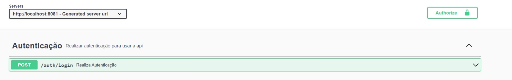

# Sales API

## Descrição
Este projeto é uma API REST construída com Spring Boot, utilizando JPA para persistência de dados em um banco de dados PostgreSQL. O sistema de autenticação é baseado no Keycloak. Para testes, foram utilizados JUnit e Mockito. A aplicação também está configurada para execução em containers Docker.

## Banco de Dados e Funcionalidades
A aplicação utiliza um banco de dados relacional para armazenar informações sobre Itens e Vendas. Abaixo estão detalhadas as principais funcionalidades relacionadas a essas entidades:

### Itens
Cada Item é um produto que pode ser vendido. Para cadastrar um novo item, é necessário fornecer um nome e um preço. Os itens cadastrados ficam disponíveis para serem incluídos em vendas.

### Vendas
Uma Venda representa uma transação de compra, contendo um ou mais itens. Para registrar uma venda, é preciso informar:

Uma descrição da venda, que serve para detalhar ou identificar a venda de maneira única.
Uma lista de IDs dos itens que compõem a venda. Esses itens devem estar previamente cadastrados no sistema.
Ao criar uma venda, o sistema calcula automaticamente o preço total da venda, somando os preços dos itens incluídos. Além disso, armazena-se informações adicionais como a data de criação e atualização da venda.

### Documentação da API com Swagger
Para facilitar a utilização e o teste da API, a documentação interativa gerada pelo Swagger está disponível no caminho: /swagger-ui/index.html. Por meio dessa interface, usuários e desenvolvedores podem visualizar todas as rotas disponíveis, parâmetros necessários e os formatos de resposta esperados. Além disso, é possível realizar requisições diretamente pela interface do Swagger, facilitando testes e a integração com outras aplicações.

Para realizar as chamadas nas rotas, primeiro realize a autenticação pela rota de autenticação e insira o "access_token" no campo authorize.



## Tecnologias Utilizadas
- Spring Boot
- JPA (Java Persistence API)
- Docker
- Keycloak (Autenticação)
- PostgreSQL (Banco de dados)
- JUnit (Testes)
- Swagger (Documentação da API)

## Pré-requisitos
- Docker e Docker Compose
- Java 17
- Maven
- Keycloak

## Configuração e Execução

### Keycloak
O Keycloak já está com os Realms, CLients e Users configurados. 
User padrão para realizar a autenticação:
username: gabriel
password: 123456

### Docker
É necessário ter o Docker instalado para rodar tanto o keycloak quanto o banco de dados. Após instalação execute o seguinte comando:
```
docker-compose up -d
```

Para verificar as instâncias do Docker pode user o seguinte comando:
```
docker ps
```

### Execução
Para realizar o run da api, execute o seguinte comando:
```
mvn spring-boot:run
```